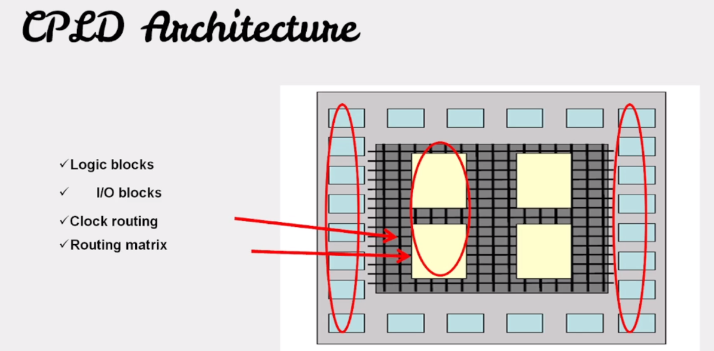
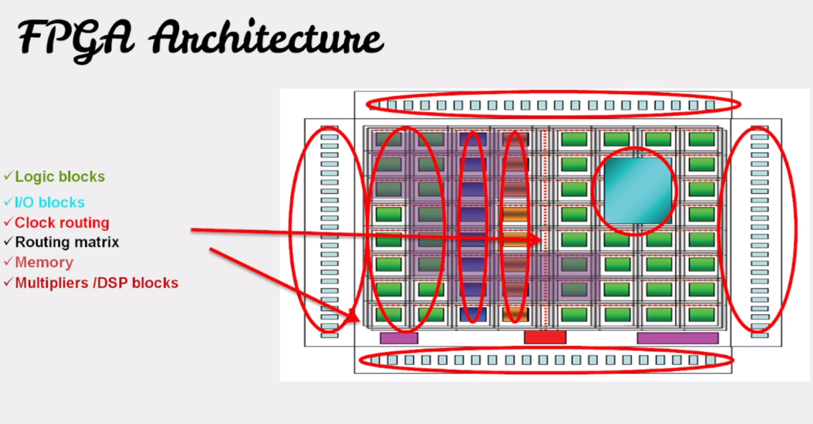
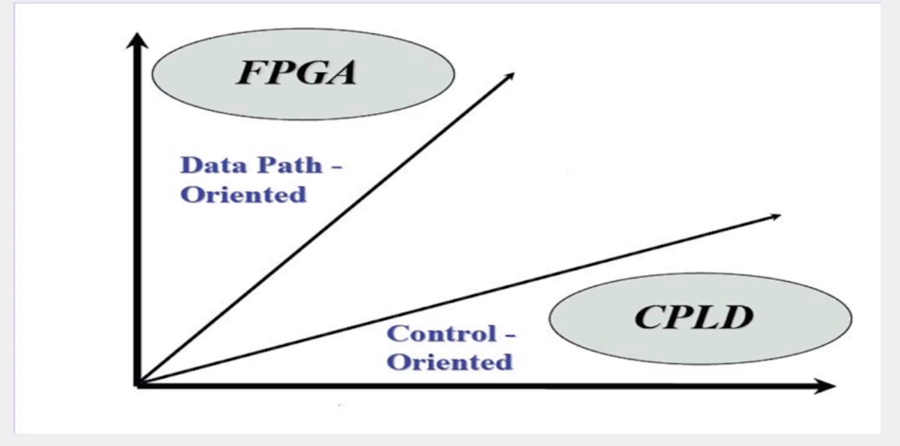
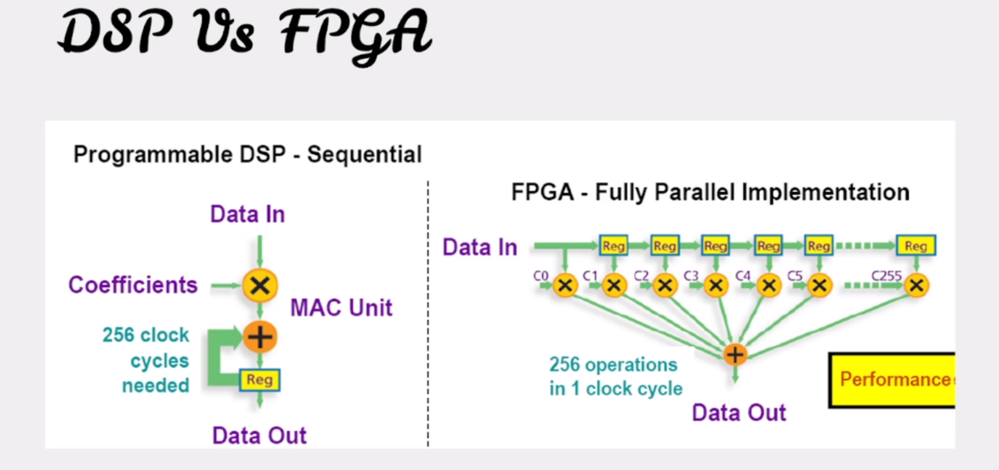
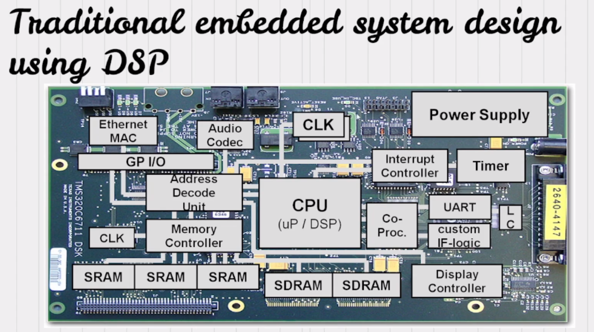
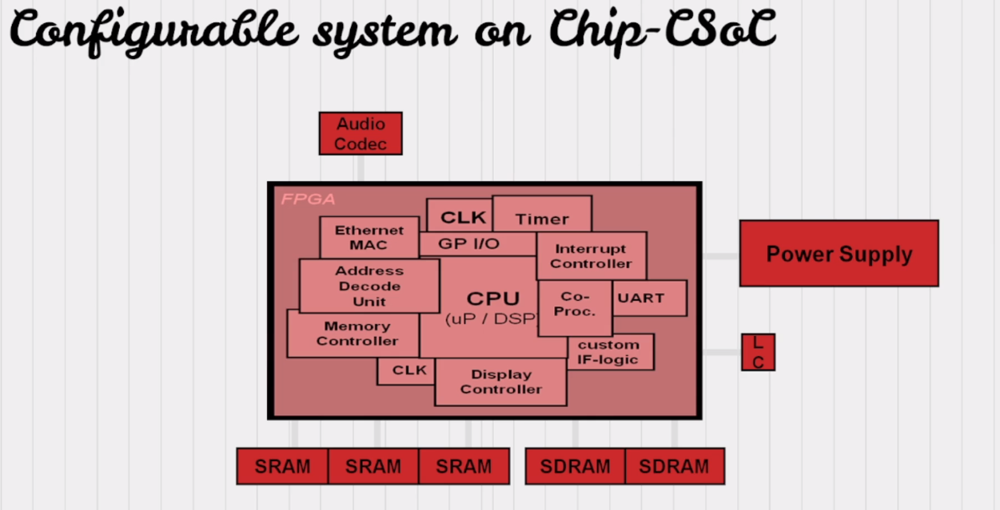
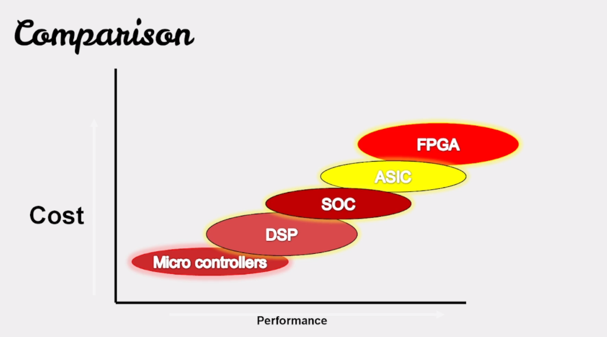
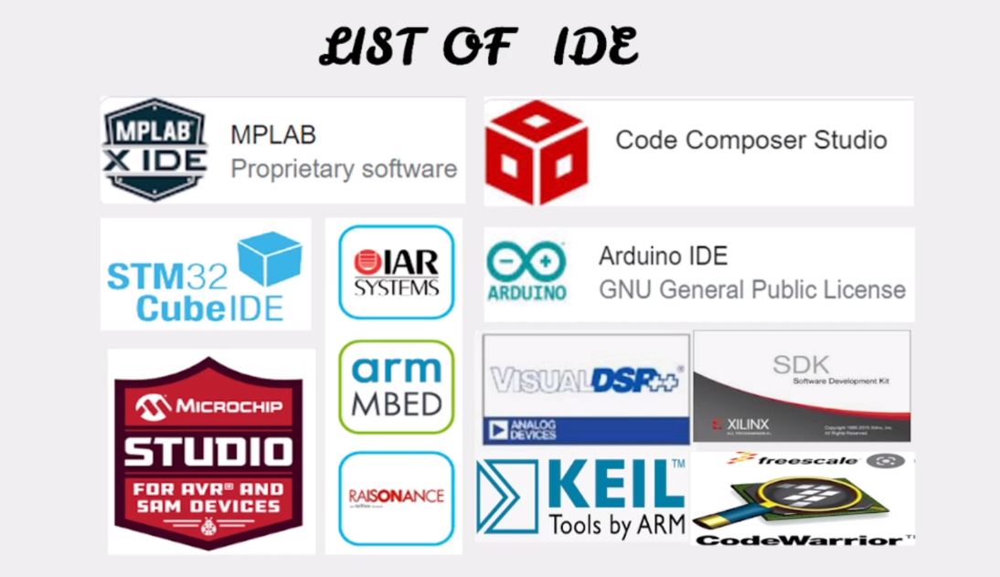
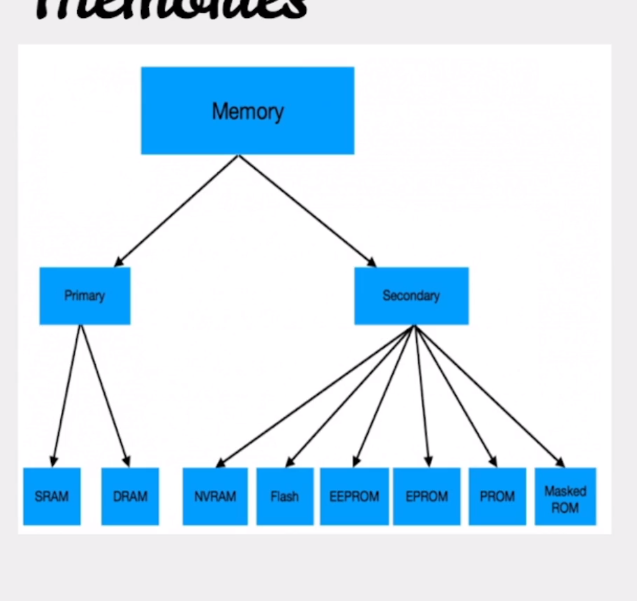

# Embedded-C
## What is Embedded System

It is a combination off microprocessor and microcontroller based hardware and software with some mechanical parts to perform a specific task is called Embedded System

## What is a Program

A program is series of instructions that cause a computer or microcontroller to perform a specific task. It will also contain data and various memory addresses on which the intructions work to perform a specific task.

## Programming languages in Embedded Systems

1. C and C++
2. Rust
3. Assembly
4. Java
5. Python

## Types of processors and controllers in Embedded System

1. Microprocessors/Microcontrollers (8/16/32) bits
2. DSP - Digital Signal Processors
3. CPDL/FPGA - Complex programmable logic device and Field programmable gate array
4. General Purpose Processors (CPUs and GPUs)
5. SOC - System on chips
6. ASIC - Application Specific integrate circuit

## Difference b/w microprocessor and controller

### Microprocessors
Microprocessor must have external peripherals to interact with outside
Example - 8085, Broadcom Chip on Raspberry Pi

Use a genrall purpose processor when the following are required:

1. Large memory
2. Advanced operating systems

### Microcontrollers
All the aforementioned peripherals like memory and timer will be internal for a microcontroller, but the resources are limited

## Difference b/w DSP and Microcontroller

| DSP   | Microconroller |
| ----------- | ----------- |
| Data path oriented      | Control oritented     |

Use a DSP processor when the following are required:
1. Precison
2. Cost Saving
3. Smaller Size
4. Low power consumptions
5. Processing of signals in real time for like imaging or speech

## Difference b/w CPLD and FPGA

### CPLD
Its more control oriented

Where we can use a CPLD we can also use a FPGA

CPLD Architecture has the following components:

1. Logic blocks
    - IO blocks
2. Clock Routing
3. Routing Matrix

### FPGA
Its more Data path oriented

We have 2 types of processor cores:

- Soft core
- Hard core

## When to use DSP in FPGA

1. Higher performance
    - Parallel algorithm implementation
2. Customizable Design
    - Optimize for speed and cost
3. System Integration
    - Less board real estate
    - Less chips could mean less sytem cost

We can tranform the above architecture to use few chips by using FPGA:

## FPGA vs ASIC
### FPGA
- Function can be changed whenever
- FPGA fabric emulates custom circuits
### ASIC
- Special chip purpose built for an application
- Function cannot be changed once expensive
## Multicore Processor
### System on Chip (SOC)
 2 or more independent processors in one package
### Symmetric Mulitprocessing
- A Number of Identical Processors
- Common Shared Memory
- One operating System

### Asymmetric Multiprocessing
- Different Processors, Instruction Sets
- Different Operating Systems
- Possibly Without Shared Memory

## Perfomance vs Cost

## IDE's for developement

## Memories
